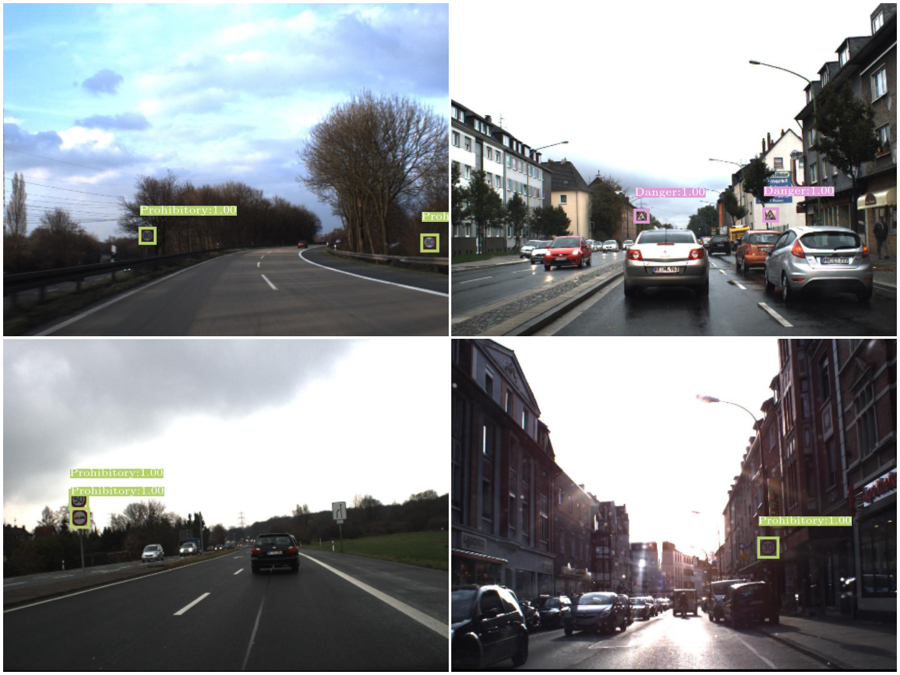
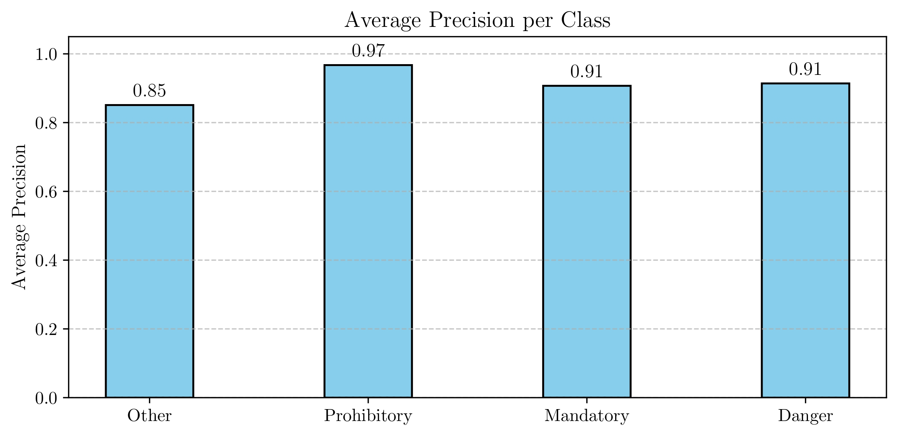
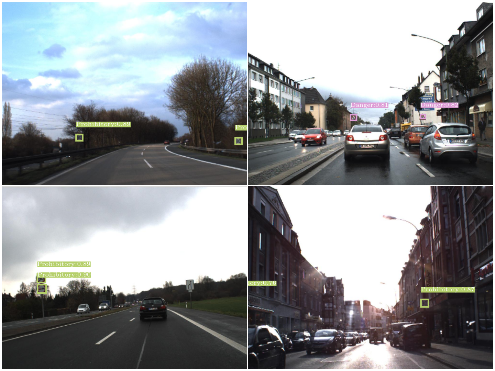
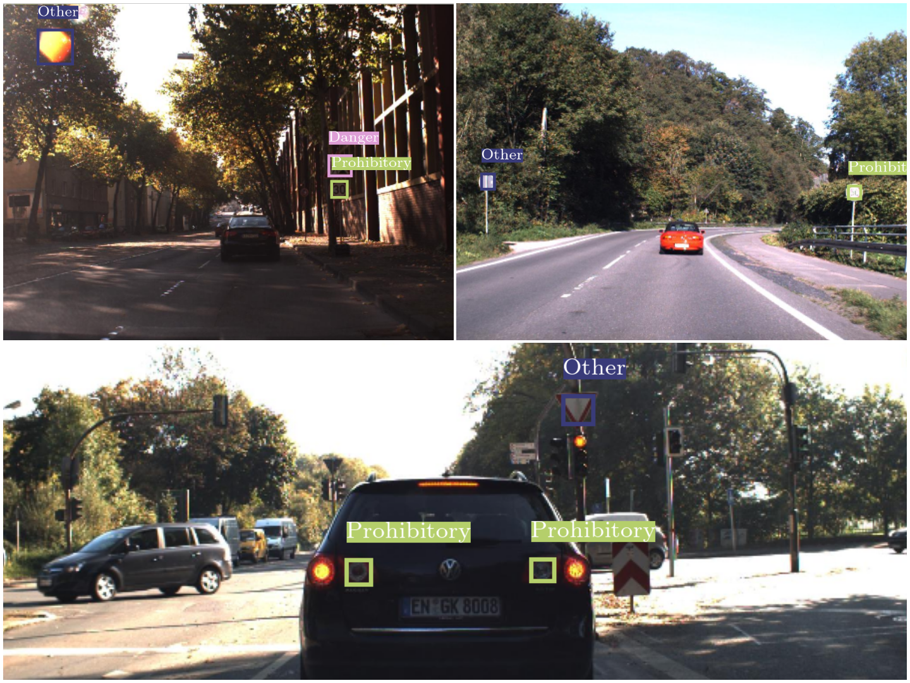

# Traffic Sign Detection on GTSDB using YOLOV3
Traffic signs encode important information about road conditions. Detecting traffic signs is therefore a critical component of modern Advanced Driver Assistance Systems (ADAS) and Autonomous Driving. These detections must be performed in all weather and road conditions with high precision, high recall and in real time. In this project, we develop a 2D traffic sign detector by adapting the YOLO-v3 object detector on the German Traffic Sign Detection Benchmark. We achieved a 91 percent mean Average Precision (mAP) after finetuning the YOLO-v3 model previously trained on the MS COCO dataset when detecting traffic signs of 4 general categories. We acheived a 14 percent mAP when detecting all 43 classes. Improvements to the training process, model architecture and dataset are required to achieve better results. 

## Methods
### Dataset : German Traffic Sign Detection Benchmark (GTSDB) [2]
The dataset consists of 900 images containing road scenes with traffic signs. Each image includes one or more instances of traffic signs in a diverse range of weather, lighting, occlusion conditions and distances to the camera. The first 600 images are reserved for training, the later 300 are for testing. The annotations consist of 2D bounding box coordinates of each traffic sign in the scene with the corresponding class. There are a total of 43 classes of traffic signs. The original benchmark groups these 43 classes into 4 superclasses. We train to predict only among these 4 superclasses. Following are some sample images from the dataset along with the bounding box, class labels and a dummy confidence score. The dataset format is converted to a compatible form. 

### Model Architecture
YOLO-V3 [3] is a general purpose object detector. The backbone of the network is a 53-layer CNN named Darknet-53. The extracted features of the backbone are then passed to the detection heads at three different scales. This is inspired by Feature Pyramid Networks. The three detection heads generate bounding box predictions at three different resolution. We made no changes to the architecture and used a Pytorch implementention by [4]

Our motivations for using YOLO-v3 instead of later versions are that it is fast at inference time, relatively simple to implement from scratch and requires less compute at training time. Due to the limitations of the dataset, GPU compute and time, we use YOLO-v3. 

### Evaluation Criteria
In scientific literature on traffic sign detection and generally object detection, mean Average Precision (mAP) is used to evaluate the performance of object detectors. We used the mean Average Precision @ 50 criteria as used in Pascal VOC 2007 dataset


### Data Augmentation
 We used data augmentation strategies like random crop, colour jitter (randomly change brightness, contrast, hue, saturation), affine transformation (change zoom level, translate left and right, rotate, and shear), horizontal flip, random blurring, colour channel shuffling, and grey scale. All these were applied with various probabilities. Finally, the images are standardized (mean 0, std 1). These transforms are also applied to the bounding box labels. 

 The images are also resized to 608x608 with a padding of 1 to reduce distortion.

### Anchor boxes
YOLO-v3 like many other object detectors does not predict the absolute coordinates of the bounding box. The bounding box centre coordinates are predicted as offsets to the position of the top left corner of the grid cell. The width and height of the box are predicted as an offset of the width and height of anchor boxes.

Anchor boxes should be chosen based on the likely size of the bounding boxes for the particular problem at hand. The authors of YOLO-v3 recommend clustering analysis on the ground truth bounding boxes to choose the best sizes for anchor boxes.

### Training
We used the pre-trained weights of YOLO-V3 MS-COCO from the orignal authors. These were obtained by first training the backbone of the model on the ImageNet classification dataset. The authors then trained the backbone along with the detection heads on MS-COCO.
After initializing a model with these pretrained weights, we train for 100 epochs on the training set of GTSDB on a learning rate of 1e4. After thaat, we train for a further 100 epochs using a learning rate of 1e5. We then test the performance on the test set

## Results
### Average Precision Per Class
Precision and recall curves for each class are calculated. The area under the curve gives us the Average Precision (AP) for each class. The AP for each class is reasonablly good. The trained model performs the worst on "Other". This class consists of an assortment of traffic signs that cannot be neatly grouped in the rest of categories. Many of these only have only a dozen or less samples in the dataset. 

### Overall Mean Average Precision (mAP)
We obtained a mAP of 91 percent while detecting 04 classes with only 600 training images. The mAP drops to just 11 percent while detecting all 43 classes. This is likely because some classes have a dozen or less samples

| Model                   | Problem                     | mAP @ 50 IoU |
| ----------------------- |:---------------------------:|:------------:|
| YOLOv3 	                | GTSDB (4 Super classes only)| 91           |
| YOLOv3                  | GTSDB (All 43 Classes)      | 11           |

### Effect of Better Anchor boxes:
Initially, we used the anchor box dimensions obtained by clustering analysis on MS-COCO as reported by the Authors of YOLO-V3. We then use the anchor box dimensions reported by [5] who did clustering analysis on GTSDB and reported the recommended anchor box dimensions. We observed that using better anchors, while keeping everything else constant, improved training and resulted in a **3 percent increase in mAP**.

### Sample Predictions:
Even with only 600 training images, the model is very good at correctly localising and detecting most traffic signs. A weakness is correctly classifying some signs, especially those belonging to the "Other" class. 
### Common Mistakes:
Just like other traffic sign detector, a common problem is incorrectly detecting many common road object as traffic signs. For example, some car tail lights are detected as traffic signs. Makeshift road barriers with red and white stripes are also incorrectly detected. Finally solar glare and reflections are also many time incorrectly detected as a traffic sign. Some traffic signs, such as advertisements and bus stop signs are also confused with traffic signs. 


## Setting up environment
- Set up a Python 3.12 environment. Python 3.12 [Miniconda Distribution](https://www.anaconda.com/download)
- Install the required packages by using pip and the provided requirements.txt file
- Install Pytorch with Cuda 13.0 using the following command:
```
pip3 install torch torchvision --index-url https://download.pytorch.org/whl/cu130
```
- In case, there are problems with installing or running Pytorch then check their [instructions](https://pytorch.org/get-started/locally/).

## GTSDB Dataset
- Download the full GTSDB Dataset file named "FullIJCNN2013.zip" from [link](https://sid.erda.dk/public/archives/ff17dc924eba88d5d01a807357d6614c/published-archive.html)
- Extract the FullIJCNN2013.zip to the root directory so that the structure is root_dir / FullIJCNN2013 / FullIJCNN2013 / Dataset files

## Download original YOLO-V3 Weights 
Download YOLOv3-608 weights for MS-COCO Dataset from [Link](https://data.pjreddie.com/files/yolov3.weights) and move the file to the root_dir / checkpoints. Save the weights to PyTorch format by running YOLOV3/model_with_weights.py.

## Built With
Python, Pytorch

## References
1. Demo video has been created by generating predictions on high quality raw footage by 

1. German Traffic Sign Detection Benchmark :
@inproceedings{Houben-IJCNN-2013,
   author = {Sebastian Houben and Johannes Stallkamp and Jan Salmen and Marc Schlipsing and Christian Igel},
   booktitle = {International Joint Conference on Neural Networks},
   title = {Detection of Traffic Signs in Real-World Images: The {G}erman {T}raffic {S}ign {D}etection {B}enchmark},
   number = {1288},
   year = {2013},
}
1. Yolov3 is an object detector based on the following research paper:
@article{yolov3,
  title={YOLOv3: An Incremental Improvement},
  author={Redmon, Joseph and Farhadi, Ali},
  journal = {arXiv},
  year={2018}
}
1. This repository uses code adapted from the [Pytorch implementation of YOLOV3](https://github.com/SannaPersson/YOLOv3-PyTorch) by Aladin Persson and Sana Persson 

1. Anchor box sizes for YOLO-V3 suitable for GTSDB by doing clustering analysis on the bounding box labels:
@article{yolov3_better_anchors,
    doi = {10.1088/1757-899X/787/1/012034},
    year = {2020},
    month = {mar},
    publisher = {IOP Publishing},
    volume = {787},
    number = {1},
    pages = {012034},
    author = {Liu, XiongFei and Xiong, Fan},
    title = {A Real-time Traffic Sign Detection Model Based on Improved YOLOv3},
    journal = {IOP Conference Series: Materials Science and Engineering},
    }

